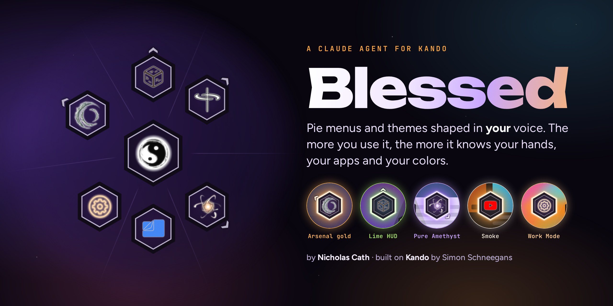
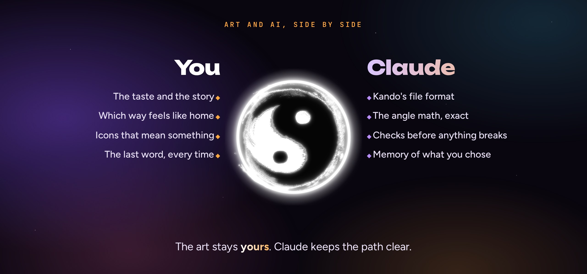
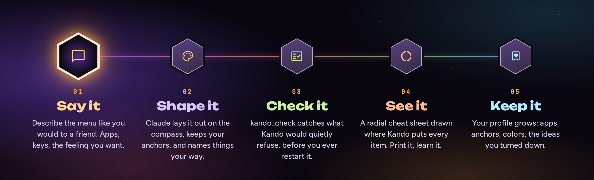
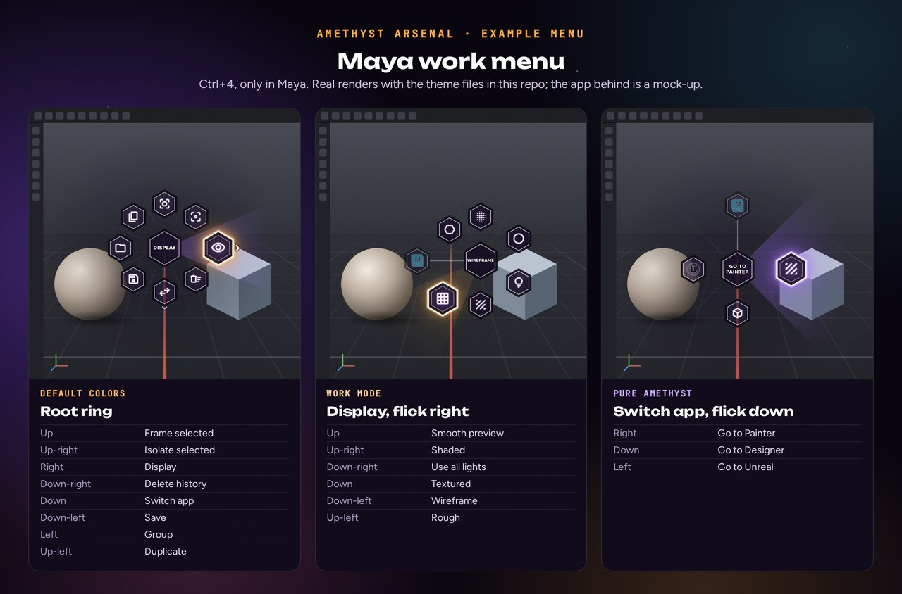
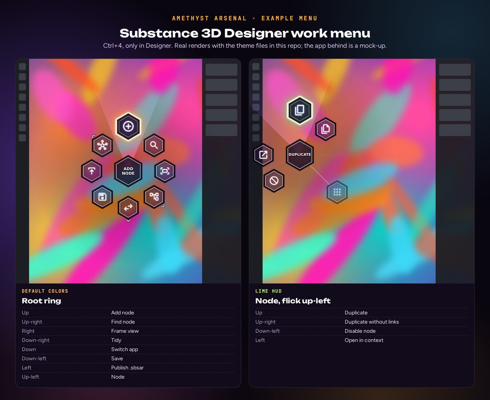
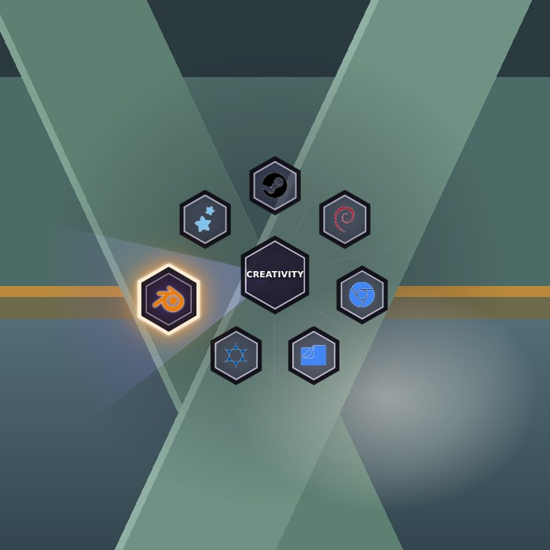
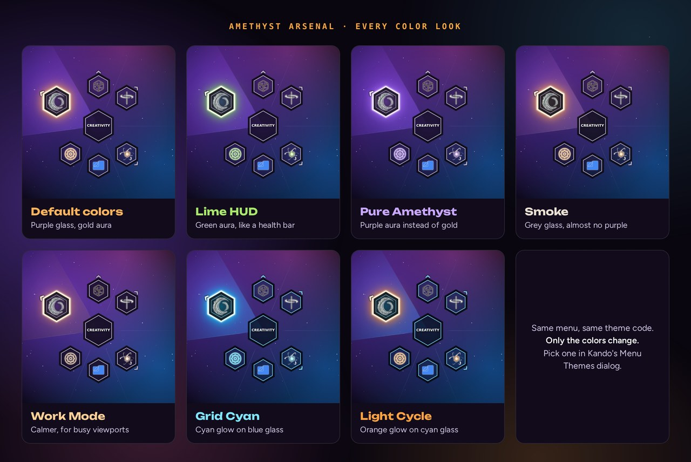
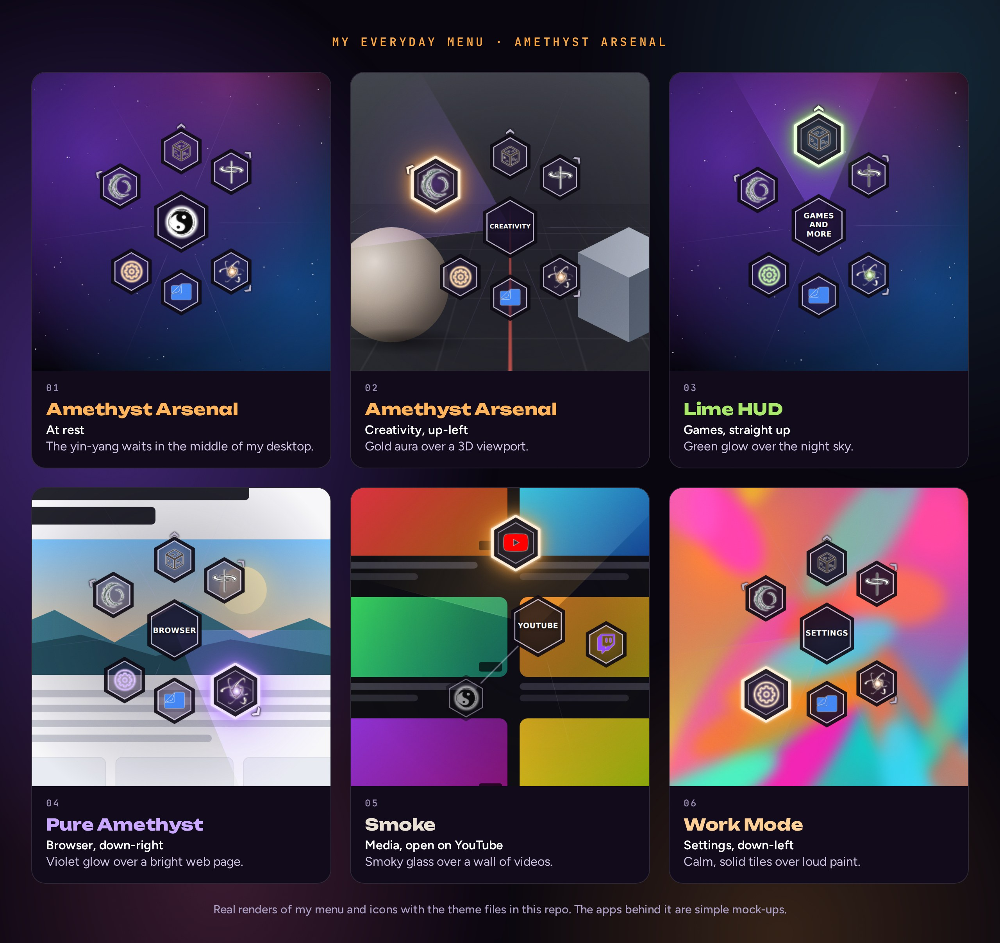

<p align="center">
  
</p>

<p align="center">
  <a href="https://github.com/nicholascathedu/kando-skill-/actions/workflows/test.yml"></a>
  <a href="https://kando.menu"></a>
  
  
</p>

<p align="center"><b>Blessed</b> is a Claude agent for <a href="https://kando.menu">Kando</a>, the pie menu by Simon Schneegans. Made by Nicholas Cath, it installs as a Claude plugin or skill.<br>
Tell it what you want in plain words. It designs the menu, checks it, draws it, dresses it in a theme,<br>
and then it remembers you, so the next menu begins where the last one left off.</p>

---

## 🌸 Kando first

Everything here stands on [**Kando**](https://kando.menu), made by
[Simon Schneegans](https://github.com/Schneegans), a developer from Germany. Press a key and a ring
of your apps and shortcuts blooms around the cursor; flick toward one and it's done. Simon calls it
*"an unconventional, fast, highly efficient, and fun way of interacting with your computer"*, and
Kando is his third pie menu, after Gnome-Pie and Fly-Pie. It is free, open source and runs on
Windows, macOS and Linux.

Blessed sits on top of Kando as a guide. It knows Kando's files and math, so you can spend your
time on how the menu feels in your hand. If Kando makes your
days faster, [support Simon on Ko-fi](https://ko-fi.com/schneegans) or
[GitHub Sponsors](https://github.com/sponsors/Schneegans).

## Why install it

Kando is easy to start and deep to master. A menu is a JSON file, and it is strict: one missing
comma or wrong value and Kando quietly keeps your old menu without saying why. Write `Ctrl` where
it wants `ControlLeft` and the item only fails when you pick it. Give an item an angle Kando
ignores and it lands somewhere you didn't plan. Blessed knows those traps before you hit them.

- **Menus that work the first time.** Claude writes Kando 3.0's real format, then runs a checker
  built from Kando's own source before anything is saved.
- **Designed for your hands.** Eight directions, the same flick for the same idea in every app,
  and the way back out of each submenu kept clear, so your hand learns the menu for good.
- **Per-app work menus.** One key opens your Maya menu in Maya, your Unreal menu in Unreal, and
  your everyday menu everywhere else.
- **Themes from a feeling.** Say *"dark purple glass, smoky, a gold glow"* and get a palette, a
  preset or a full menu theme, written with Kando's real class names.
- **It gets personal.** A small profile keeps your apps, the directions you've locked in, your
  colors and the ideas you said no to. Every session starts from there.
- **Nothing hidden.** A few short Python scripts, no installs, tested on Windows and Linux.

## Art and AI, side by side

<p align="center"></p>

I make art, and I didn't want a tool that makes it for me. I wanted one that carries the weight
I don't need to carry — the file format, the angles, the bookkeeping — so the choices that carry
meaning stay mine. Which icon sits at the top of my menu, which color glows when I reach for it,
which direction my hand already knows: that's taste, and taste belongs to the person.

So Blessed works like the two halves of a yin-yang. You bring the story and the final word.
Claude brings precision and memory. Neither half pretends to be the other, and the menu you end
up with looks and moves like you, because you made every call that counts.

## How it works

<p align="center"></p>

1. **Say it.** *"A Blender menu, only in Blender, fast for sculpting."*
2. **Shape it.** Claude lays it out on the compass, keeps the directions you already use, and
   names things the way you do.
3. **Check it.** `kando_check.py` catches what Kando would refuse without a word.
4. **See it.** `kando_preview.py` prints the compass outline and can draw a printable cheat sheet with every item where Kando will really put it.
5. **Keep it.** Your profile learns what you chose, so the next request needs fewer words.

<p align="center"></p>

The checker speaks plainly:

```text
$ python kando_check.py menus.json
ERROR  [Quick] > Save > selectWorkflow[1]
       'Ctrl' in hotkey 'Ctrl+S' is not a key code. Did you mean 'ControlLeft'?
WARN   [Maya] > Display
       'Wireframe' (270°, Left) sits on the way back to the parent (270°).
       Flicking that way is ambiguous; move it at least 45° away.
TIP    shortcut control+4
       Every menu on this shortcut has conditions. In any other app the key is
       still swallowed but no menu opens. Add a fallback menu with no conditions,
       or, if another app needs this key, move the menus to a combo nothing uses.
```

## A workflow for Substance 3D Designer

Designer is where I build materials from nothing: noise and patterns become a height map, the
height map becomes normal, AO and curvature, and all of it ends up as a .sbsar that Painter and
Unreal can open. It is also a lot of small keys spread across three views, which is exactly
what a pie menu is good at.

<p align="center"></p>

- **Up adds a node** (Space), because it is the move I make most.
- **Left publishes the .sbsar** (Ctrl+P). In Painter, Left exports textures. Same flick, same
  meaning: send it out.
- **Down twice** jumps to Painter, and Down twice in Painter comes back. Down is "Switch app" in
  every work menu, and Designer sits straight down inside it from Maya, Painter and Unreal.
- Every key comes from Adobe's current Designer docs (version 16.0). The menu is in
  [`examples/3d-work-menus.json`](skills/kando/examples/3d-work-menus.json), with notes in
  [`app-recipes.md`](skills/kando/references/app-recipes.md).

## It remembers you

The first time you work together, Claude offers to write a `kando-profile.md` next to your
`menus.json`. `kando_profile.py` drafts it from the menus you already have: your shortcuts, the
apps you work in, the directions each menu uses, the items that sit in the same place everywhere
(your anchors), and the ones that drift between menus. Then you and Claude add the human part:
palette words, how you like things named, the workflows you care about, the ideas you turned down.

From then on, Claude reads it first. Anchors stay put. New menus borrow your voice and your
colors. A rejected idea doesn't come back. Nothing is written without your OK, and no paths, IDs
or secrets go in it.

## Showcase

### Amethyst Arsenal

<p align="center"></p>

Some menus you remember for years. The weapon wheel in *Ratchet & Clank Future: A Crack in Time*
is one of mine: a ring of glowing tiles you open in the middle of chaos, one flick, and you're
back in the fight with exactly what you needed. Kando gives that feeling to a desktop, so I built
a theme that honors it — smoky hex tiles you can see through, a dark frame, and a soft gold aura on
the one you're reaching for, all washed in amethyst.

Its own look, the gold aura, is what Kando lists as **Default colors**. Six presets come with
it: **Lime HUD**, **Pure Amethyst**, **Smoke**, **Work Mode** (a calmer one for busy 3D viewports), and two
Tron-style looks, **Grid Cyan** and **Light Cycle**. [Install it from `themes/amethyst-arsenal`.](themes/amethyst-arsenal)

<p align="center"></p>

### A menu with a yin-yang at its heart

My own everyday menu opens around a yin-yang, and it fits Kando well: Simon built a tool that is *fast and efficient* and also *fun*,
two halves most software keeps apart. A pie menu holds both. The center is stillness; every
direction around it is motion.

The tiles are glass, so whatever I'm working in still shows through. Here it is over a few
different apps, in the default colors and each preset, reaching in a different direction every time.

<p align="center"></p>

## Does it actually help?

I tested it the honest way: twelve real Kando tasks, each run three times with the skill and
three times without, scored by plain pass or fail rules. With the skill Claude scored
**0.89**, without it **0.60**.

| Task | With | Without |
|---|---|---|
| A 19-action Maya work menu | 3/3 | 1/3 |
| A Blender menu with a Shading submenu | 3/3 | 0/3 |
| A color preset in the right place | 3/3 | 1.4/3 |
| "Smoke and amethyst" on the Default theme | 2/3 | 0/3 |
| Fixing a broken menus.json | 3/3 | 3/3 |

Where it ties, plain Claude already knows the answer. Where it wins, it's Kando's own rules:
angles, submenus, theme files. The full table, including the one task it lost, is in
[`evals/`](evals), and you can rerun it yourself.

## Install

**Claude Code** (as a plugin, Claude Code 2.1.275 or later)

```text
/plugin install kando --marketplace nicholascathedu/kando-skill-
```

On older versions, run `/plugin marketplace add nicholascathedu/kando-skill-` and then
`/plugin install kando@blessed`. To install only the skill instead:

```bash
git clone https://github.com/nicholascathedu/kando-skill-
cp -r kando-skill-/skills/kando ~/.claude/skills/
```

**Claude apps:** zip the `skills/kando` folder and upload it in Settings → Capabilities → Skills.

The scripts need Python 3.9+ and nothing else. They run on their own too:

```bash
python skills/kando/scripts/kando_check.py   "%APPDATA%\kando\menus.json"
python skills/kando/scripts/kando_preview.py "%APPDATA%\kando\menus.json" --html sheet.html
python skills/kando/scripts/kando_profile.py "%APPDATA%\kando\menus.json" --out kando-profile.md
```

## Try asking

| You say | Claude does |
|---|---|
| "Look at my Kando menus. What would make them faster?" | Reads your files and profile, checks and previews them, then suggests changes ring by ring |
| "Make me a Blender menu that only shows in Blender." | Designs the compass layout, writes the JSON, checks it, shows the sheet |
| "I edited menus.json and now nothing changes." | Finds the error Kando hit and fixes it |
| "I want it to feel like smoke and amethyst." | Builds a palette, then a color preset or a full theme |
| "Remember that up is always Save for me." | Adds it to your profile as an anchor and keeps it in every menu |
| "How do I open Kando with my mouse's side button?" | Walks you through mapping a spare key and using turbo mode |

## What's inside

```text
skills/kando/
├── SKILL.md              the workflow Claude follows
├── references/           menus.json format · settings · navigation · menu design
│                         themes · app hotkeys (Maya, Painter, Unreal, Blender…)
│                         your profile · sources
├── scripts/
│   ├── kando_check.py      validator and linter
│   ├── kando_preview.py    compass outline and radial HTML cheat sheet
│   ├── kando_profile.py    drafts your personal profile from your menus
│   └── kando_layout.py     Kando's placement algorithm, ported
└── examples/             a desktop launcher and Maya / Painter / Unreal work menus
themes/
└── amethyst-arsenal/     a Kando menu theme (CC0), drop it in your menu-themes folder
tests/                    python -m unittest discover -s tests
evals/                    real tasks that score Claude with and without the skill
.claude-plugin/           plugin and marketplace manifests
```

## Sources and credits

- **Kando** is made by [Simon Schneegans](https://github.com/Schneegans) and its contributors,
  MIT licensed. The skill was built from Kando's official docs at [kando.menu](https://kando.menu),
  its source code (the settings schemas, the placement math and the actions) and Simon's videos,
  for **Kando 3.0**. Where the docs and the code disagree, the skill follows the code; the
  differences are listed in [`references/sources.md`](skills/kando/references/sources.md).
- The Amethyst Arsenal theme builds on the tile positioning of Kando's built-in Default theme by
  Simon Schneegans (CC0).
- *Ratchet & Clank* is a trademark of Sony Interactive Entertainment LLC. Amethyst Arsenal is a fan
  tribute that uses none of the game's files and is not affiliated with or endorsed by Insomniac
  Games or Sony Interactive Entertainment.
- Blessed is an independent project and is not affiliated with Kando or Anthropic.
- App logos in the artwork come from [Simple Icons](https://simpleicons.org) and belong to their owners.

Made with care by **Nicholas Cath**. The skill is MIT licensed and the theme is CC0: take them,
change them, make them yours.
