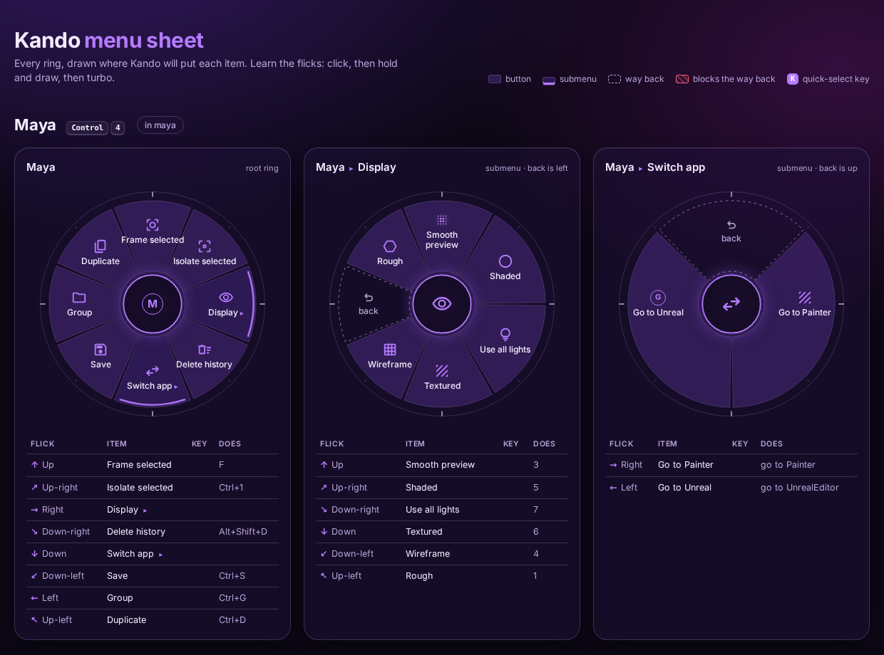
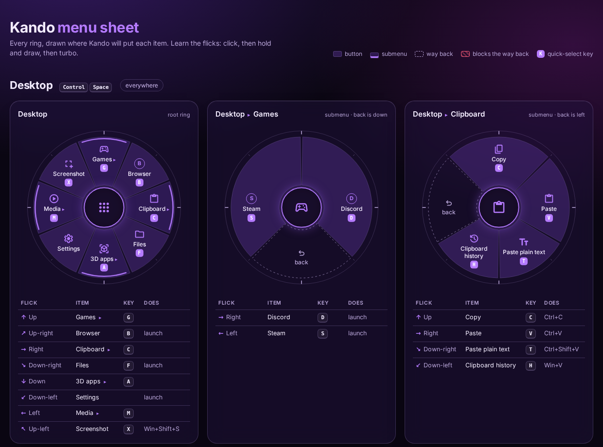

<h1 align="center">Kando skill for Claude</h1>

<p align="center">
  <b>Design, fix, theme and learn pie menus for <a href="https://kando.menu">Kando</a>, just by asking Claude.</b>
</p>

<p align="center">
  <a href="https://github.com/nicholascathedu/kando-skill-/actions/workflows/test.yml"></a>
  
  
  
</p>

<p align="center">
  
</p>

Kando is the free, open-source pie menu by Simon Schneegans: press a shortcut, a ring of
items appears around your mouse, and you flick toward the one you want. This skill teaches
Claude the Kando 3.0 file format, how Kando actually places items, and what makes a pie menu
fast, so you can say *"make me a Blender menu on Ctrl+4"* and get one that works the first time.

## What you get

**🧭 Menus designed for muscle memory.** Fixed directions, about 8 items per ring, the same
gesture for the same idea in every app, and the way back out of each submenu kept clear.

**🎯 Per-app work menus on one key.** One shortcut opens a Maya, Painter, Unreal or Blender
menu depending on the app in front, with your normal menu everywhere else.

**🗺️ A cheat sheet that matches reality.** `kando_preview.py` runs a port of Kando's own
placement code and draws every ring exactly where Kando will put it. Print it and keep it next
to your screen while the flicks sink in.

<p align="center"></p>

**🛡️ A checker that catches what Kando silently ignores.** Kando refuses an invalid file
without telling you. `kando_check.py` finds the problem first:

```text
$ python kando_check.py menus.json
ERROR  [Quick] > Save > selectWorkflow[1]
       'Ctrl' in hotkey 'Ctrl+S' is not a key code. Did you mean 'ControlLeft'?
WARN   [Maya] > Display
       'Wireframe' (270°, Left) sits on the way back to the parent (270°).
       Flicking that way is ambiguous; move it at least 45° away.
TIP    shortcut control+4
       Every menu on this shortcut has conditions. In any other app the key is
       still swallowed but no menu opens. Add a fallback menu with no conditions.
```

It also knows Kando 2.x leftovers, angles Kando will drop, hotkeys that fire before the menu
closes, clashing quick-select keys, and with `--publish` it flags personal data (user folders,
IDs, emails) before you share a menu.

**🎨 Themes from a vibe.** Say "dark purple glass" and Claude turns it into a palette, then a
color override, a preset, or a full menu theme (`theme.json5` + CSS), using Kando's real class
names and CSS variables.

**📚 Learn it properly.** Every setting explained with tuning recipes ("make it snappier",
"it picks things I didn't mean"), and Simon's path from point-and-click to marking and turbo mode.

## Install

**Claude Code**

```bash
git clone https://github.com/nicholascathedu/kando-skill-
cp -r kando-skill-/skills/kando ~/.claude/skills/
```

**Claude apps:** zip the `skills/kando` folder and upload it in Settings → Capabilities → Skills.

The scripts need Python 3.9+ and nothing else. They also run on their own:

```bash
python skills/kando/scripts/kando_check.py "%APPDATA%\kando\menus.json"
python skills/kando/scripts/kando_preview.py "%APPDATA%\kando\menus.json" --html sheet.html
```

## Try asking

| You say | Claude does |
|---|---|
| "Look at my Kando menus and tell me what would make them faster." | Checks and previews your files, then proposes changes ring by ring |
| "Make me a Blender menu on Ctrl+4 that only shows in Blender." | Designs the compass layout, writes the JSON, checks it, shows the sheet |
| "I edited menus.json and now nothing changes." | Finds the error Kando hit and fixes it |
| "I want a dark purple transparent look." | Builds a palette, then a color override or a full theme |
| "How do I open Kando with my mouse's side button?" | Walks you through Ctrl+F13 mapping and turbo mode |

## What's inside

```text
skills/kando/
├── SKILL.md            the workflow Claude follows
├── references/         menus.json format · settings · navigation · menu design
│                       themes · app hotkeys (Maya, Painter, Unreal, Blender…) · sources
├── scripts/
│   ├── kando_check.py    validator and linter
│   ├── kando_preview.py  compass outline and radial HTML cheat sheet
│   └── kando_layout.py   Kando's placement algorithm, ported
└── examples/           a desktop launcher and Maya / Painter / Unreal work menus
tests/                  python -m unittest discover -s tests
```

## Sources

Built from Kando's official docs, its source code (the settings schemas, the placement math
and the action implementations) and Simon's videos, for **Kando 3.0**. Where the 3.0 docs and
code disagree, the skill follows the code; the differences are listed in
[`references/sources.md`](skills/kando/references/sources.md).

Not affiliated with Kando. Kando is MIT-licensed by Simon Schneegans, and so is this skill.
If Kando makes your day faster, consider [supporting Simon](https://kando.menu/donating/).
