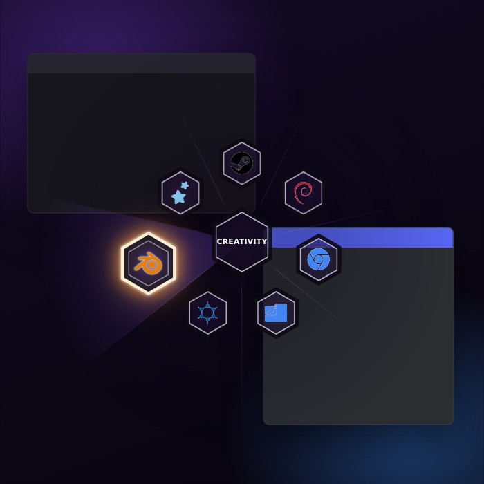

# Amethyst Arsenal

A menu theme for [Kando](https://kando.menu) 3.0, the cross-platform pie menu.

Inspired by the weapon selection wheel of **Ratchet & Clank Future: A Crack in Time**: hex tiles with a dark frame and a see-through face, and a soft gold aura on the item you select. This version adds a dark purple tint.

## What it looks like

- Every item is a hex tile with a dark frame, a thin light line, and a see-through purple face, so the app behind the menu shows through.
- The selected tile pops out with a cream frame, a dark face with a purple glow in the middle, and a soft gold aura.
- The center tile shows the selected item's name in bold capitals.
- Black logos like Steam or Unreal Engine get a thin light outline, so they stay visible on the dark tiles.
- With quick-select keys turned on, each tile shows its key as a small controller-style button.
- With selection wedges turned on, the direction you point at lights up softly.

## Install

1. Download this folder (`amethyst-arsenal`) and put it in Kando's `menu-themes` folder:

   | System | Folder |
   |---|---|
   | Windows | `%appdata%\kando\menu-themes\` |
   | macOS | `~/Library/Application Support/kando/menu-themes/` |
   | Linux | `~/.config/kando/menu-themes/` |
   | Linux (Flatpak) | `~/.var/app/menu.kando.Kando/config/kando/menu-themes/` |

   You should end up with `menu-themes/amethyst-arsenal/theme.json5`.

2. Restart Kando.
3. Open Kando's settings, go to **Menu Theme**, and pick **Amethyst Arsenal**. If you use a separate dark-mode theme, pick it there too.

### Optional settings that suit the theme

- **Selection wedges** (General settings): lights up the direction you point at.
- **Draw quick-select keys**: shows each item's key as a button on its tile.

## Color presets

Kando shows these under the theme's color settings:

| Preset | Look |
|---|---|
| Amethyst Arsenal | Purple glass with a gold aura (default) |
| Lime HUD | Green aura, like a game health bar |
| Pure Amethyst | Purple aura instead of gold |
| Smoke | Grey glass with almost no purple |
| Work Mode | Less see-through and a softer glow, for busy apps like 3D viewports |

## Make it your own

- **Colors:** change any color in Kando's settings under the theme's colors, or edit the `colors` list in `theme.json5`. Every color has a comment saying what it paints, and transparency works, for example `rgb(40 22 68 / 0.40)`.
- **Sizes, glow and speed:** open `theme.css` and edit the **Tweak me** block at the top. You can change tile sizes, frame thickness, icon size, how much the selected tile grows, how far the aura reaches, and the animation speed.
- **See changes live:** in Kando's settings, the Development tab has a **Reload Menu Theme** button. Changes to `theme.json5` show up the next time you open a menu.

## Compatibility

- Made for Kando 3.0 (theme engine version 1) and tested against Kando 3.0.0's menu code.
- It works with any number of items. Menus with more than 9 items spread out so tiles never overlap.
- It works with every icon type Kando supports: app icons, icon fonts, emoji and images.
- Turning off **Menu animations** in Kando, or turning on your system's "reduce motion" setting, switches off all animation.

## Credits and license

- Theme by [nicholascathedu](https://github.com/nicholascathedu), released under [CC0-1.0](https://creativecommons.org/publicdomain/zero/1.0/): use, change and share it however you like.
- Tile positioning is based on Kando's built-in Default theme by Simon Schneegans (CC0-1.0).
- The look is inspired by the weapon wheel in *Ratchet & Clank Future: A Crack in Time*. This is a fan-made tribute that does not use any of the game's files. It is not affiliated with or endorsed by Insomniac Games or Sony Interactive Entertainment. Ratchet & Clank is a trademark of Sony Interactive Entertainment LLC.
